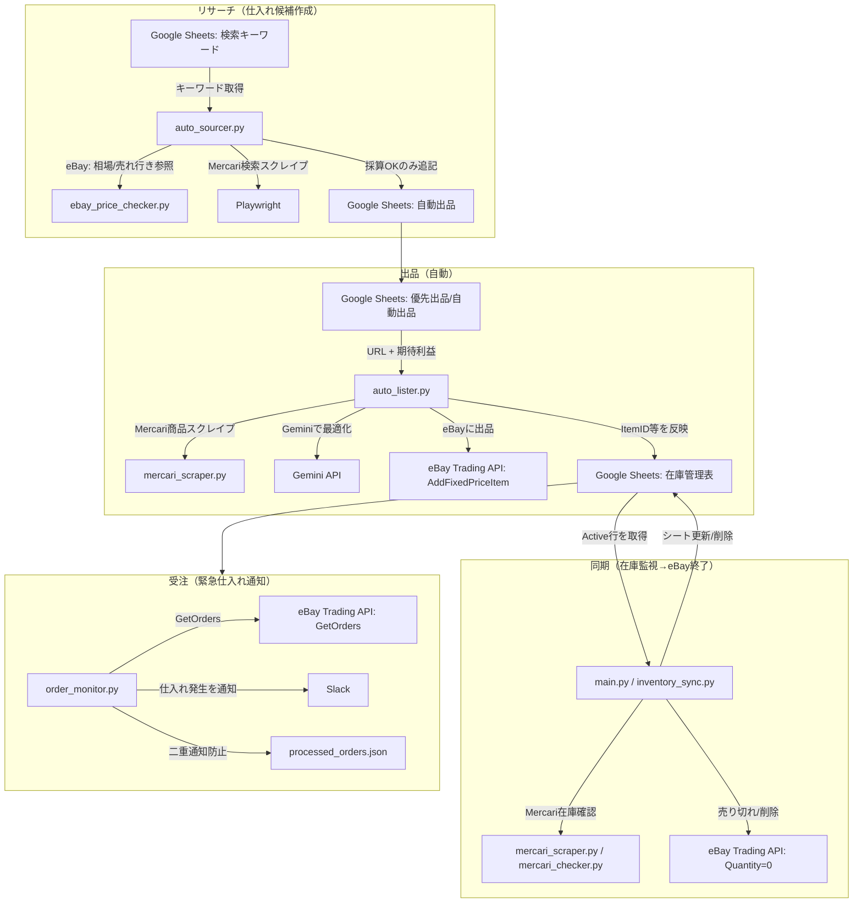

## 全体フロー（見栄え用まとめ）

このプロジェクトは大きく「リサーチ → 出品 → 同期（在庫/価格）→ 受注通知」で回ります。

## 「普段どれを回す？」（最小）
- **自動で在庫監視（停止防止が最優先）**: `main.py`（cronで定期実行）
- **自動で仕入れ候補作成**: `auto_sourcer.py`（必要なら定期実行）
- **自動で出品**: `auto_lister.py`（優先出品→自動出品の順に処理）
- **売れたら通知**: `order_monitor.py`（定期実行 or 常駐運用）

